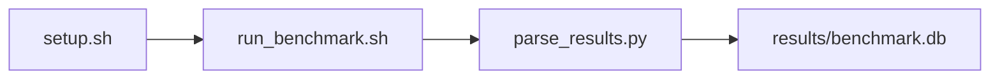

# ResNet-50 BF16 Inference Throughput Sweep Benchmark

[](LICENSE)
[](.github/workflows/ci.yml)

Target: Ubuntu 26.04 · NVIDIA · see Hardware Requirements. This is a host benchmark, not a laptop `pip install` project.

## Quick Start

```bash
git clone https://github.com/garys-gpu-benchmarks/422-gpu-bench-nvidia-resnet50-pytorch-inference-ubu2604.git
cd 422-gpu-bench-nvidia-resnet50-pytorch-inference-ubu2604
sudo bash setup.sh --assume-yes
bash run_benchmark.sh --profile smoke --validate
```
Results are written to `results/benchmark.db` and `results/summary.json`.

This workload is executed on the validation host after the repository is copied there. `setup.sh` and `run_benchmark.sh` do not open an outbound SSH session.

Prerequisites: Ubuntu 26.04; NVIDIA; Python 3.14.4; root or sudo for `setup.sh`. Framework: Bash, SQLite, Python, PyYAML, CUDA Runtime, PyTorch-CUDA, torchvision, ResNet-50. This is a host benchmark, not a laptop `pip install` project.



## 1. Overview

Runs gpu-bench-resnet50-pytorch-inference.py with random ResNet-50 weights, synthetic images, and bf16 under torch.no_grad(). batch_size: comma-separated sweep. image_size, dtype/precision bf16, warmup_iters, and num_iterations come from yaml. This is a local inference sweep, not a five-minute server and not TorchBench Sweep dimensions: device_id, num_gpus, parallel_strategy, weights, dtype, precision, image_source, image_size.

## 2. What It Validates

- Validates one inference sweep over yaml batch sizes with random weights and synthetic images
- #1: Largest-batch inference throughput, images/s (images_per_sec); is present and physically sensible.
- #2: Largest-batch per-image latency, ms (per_image_latency_msec); is present and physically sensible.
- #3: Largest-batch p99 latency, ms (batch_p99_latency_msec); is present and physically sensible.
- #4: Largest-batch GPU utilization (gpu_utilization_percent); is present and physically sensible.
- #5: Peak GPU memory at largest batch, GB (peak_gpu_memory_gb) is present and physically sensible.

## 3. Metrics Captured

- **#1: Largest-batch inference throughput, images/s** — stored as `images_per_sec`.
- **#2: Largest-batch per-image latency, ms** — stored as `per_image_latency_msec`.
- **#3: Largest-batch p99 latency, ms** — stored as `batch_p99_latency_msec`.
- **#4: Largest-batch GPU utilization** — stored as `gpu_utilization_percent`.
- **#5: Peak GPU memory at largest batch, GB** — stored as `peak_gpu_memory_gb`.

## 4. Hardware Requirements

### Supported environment

- OS: Ubuntu 26.04
- GPU vendor: NVIDIA
- Framework family: Bash, SQLite, Python, PyYAML, CUDA Runtime, PyTorch-CUDA, torchvision, ResNet-50
- Python: Python 3.14.4

### Reference validation environment

The tables below describe the machine used to generate the reference results. They are not a requirement that every user buy that exact cloud instance.

### System

Runs gpu-bench-resnet50-pytorch-inference.py with random ResNet-50 weights, synthetic images, and bf16 under torch.no_grad(). batch_size: comma-separated sweep. image_size, dtype/precision bf16, warmup_iters, and num_iterations come from yaml.

### GPU

Ubuntu 26.04 / NVIDIA / Bash, SQLite, Python, PyYAML, CUDA Runtime, PyTorch-CUDA, torchvision, ResNet-50

## 5. Software Requirements

| Component | Version |
|---|---|
| OS | Ubuntu 26.04 |
| Kernel | kernel 7.0.0 |
| Python | Python 3.14.4 |
| ROCm | CUDA 13.3 |
| rocBLAS | N/A - rocBLAS not used |

Runs gpu-bench-resnet50-pytorch-inference.py with random ResNet-50 weights, synthetic images, and bf16 under torch.no_grad(). batch_size: comma-separated sweep. image_size, dtype/precision bf16, warmup_iters, and num_iterations come from yaml.

## 6. Installation

```bash
Run gpu-bench-resnet50-pytorch-inference.py via collect_resnet50_infer.py; nvidia-smi is sampled on a background thread during the timed loop for GPU utilization, and peak memory comes from torch.cuda.max_memory_allocated
```

## 7. Running the Benchmark

```bash
Run gpu-bench-resnet50-pytorch-inference.py via collect_resnet50_infer.py; nvidia-smi is sampled on a background thread during the timed loop for GPU utilization, and peak memory comes from torch.cuda.max_memory_allocated
```

**Validating results separately:**

```bash
export BENCHMARK_PYTHON=/usr/bin/python3.13  # optional
python3 -m venv .venv
source ".venv/bin/activate"
".venv/bin/python" scripts/validate_results.py
```

## 8. Output

### `results/benchmark.db` (SQLite)

raw_results.csv with one row per batch size and a summary row. The summary copies the largest batch and also stores case_* copies

check,batch_size,headline_batch_size,dtype,status,images_per_sec,per_image_latency_msec,batch_p99_latency_msec,gpu_utilization_percent,peak_gpu_memory_gb
summary,32,32,bf16,ok,900,1.1,40,95,8

```bash
Run gpu-bench-resnet50-pytorch-inference.py via collect_resnet50_infer.py; nvidia-smi is sampled on a background thread during the timed loop for GPU utilization, and peak memory comes from torch.cuda.max_memory_allocated
```

### `results/summary.json`

Consolidated metrics from the most recent run — suitable for CI artifact upload or dashboard ingestion.

### `results/raw/<timestamp>.txt`

raw_results.csv with one row per batch size and a summary row. The summary copies the largest batch and also stores case_* copies

check,batch_size,headline_batch_size,dtype,status,images_per_sec,per_image_latency_msec,batch_p99_latency_msec,gpu_utilization_percent,peak_gpu_memory_gb
summary,32,32,bf16,ok,900,1.1,40,95,8

## 9. Baselines / Thresholds

Expected ranges and gates live in `config/benchmark_config.yaml` under `baselines:` or `thresholds:`. To update them, edit that file — never edit validation code directly.

## 10. Troubleshooting

**`setup.sh` missing collector**
Create cannot finish without `scripts/collect_workload.py`.

**`self_check` overlay rewritten**
Do not overwrite files listed in `results/overlay_lock.json`.

**Remote SSH drop during setup**
Reconnect and resume `bash setup.sh --assume-yes`. Do not wipe `.venv` or `.cache`.

## 11. NVIDIA H100 Coding Differences

Native NVIDIA CUDA workload. Execute on the stated Ubuntu release with the host NVIDIA driver and CUDA userspace. ROCm porting notes do not apply.

## Repository layout

```text
.
├── setup.sh
├── run_benchmark.sh
├── benchmark_specification.json
├── config/
├── scripts/
├── src/
├── tests/
├── docs/
├── results/
└── LICENSE
```
